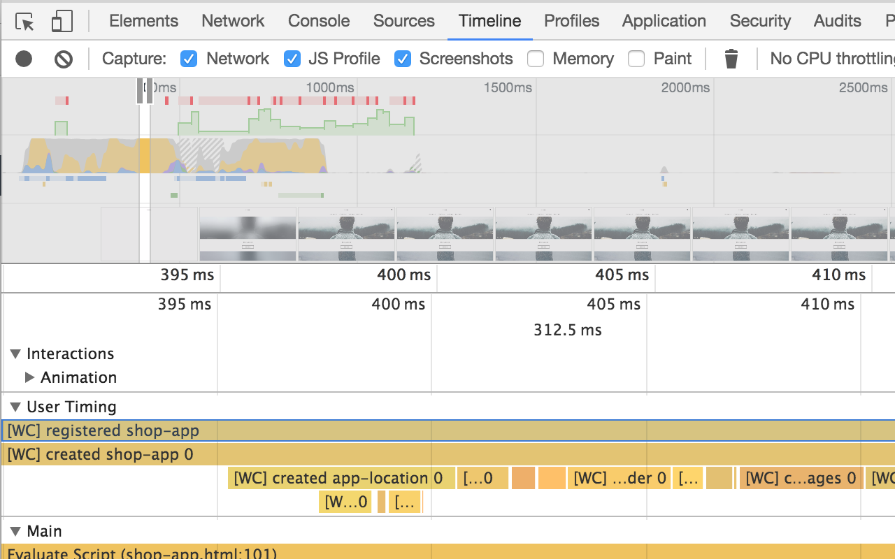

# polydev

polydev is the Polymer DevTools Extension - a tool to help develop Polymer and
custom elements. Currently it's focused on performance tracking of web components.

## How to Use

  1. [Install the extension](https://chrome.google.com/webstore/detail/polymer-devtools-extensio/mmpfaamodhhlbadloaibpocmcomledcg).
  2. On a page that uses web components, [make a timeline recording](https://developers.google.com/web/tools/chrome-devtools/evaluate-performance/timeline-tool#make_a_recording).
  3. Look under the User Timing section of the timeline to track time spent in custom element lifecycle callbacks, as well as time spent reacting to Polymer databinding changes.

### How to read the results



Each web component lifecycle callback will be annotated as a span in the timeline called a [`measure`](https://www.html5rocks.com/en/tutorials/webperformance/usertiming/), representing the time that it took. If a measure is below another measure, the lower callback took place during the higher callback.

Each measure that polydev produces has a unique name like `[WC] created paper-icon-button 5`. The format is `[WC] callbackName tagName id`. The id numbers are on a per instance and per tag basis and count up from zero.

### API

polydev exposes a method on the host page called _getElementMeasures. It returns an array of ElementMeasure objects, which obey the following interface:

```typescript
interface ElementMeasurement {
  tagName: string;
  operation: string;
  elementId: number|undefined;
  duration: number;
  start: number;
  end: number;
}
```

## Development

### Building

polydev must be built before running. The build step externalizes inline scripts
for CSP compliance, and copies some dependencies into convenient locations.

To build, run `npm run build`:

    > npm run build

The built project is available at `build/polydev`.

### Installation

 1. Create a new Chrome profile
 2. Navigate to chrome://extensions
 3. Check the "Developer mode" checkbox
 4. Click "Load unpacked extension..."
 5. Choose `polydev/build/polydev`

### Dev flow

When changing files in src/ the dev workflow should work cover most use cases.

    > npm run dev

Depending on the change you can either then close and reopen the devtools, or if
you've made a change to the content-script or to element-zones, you must reload
both the extension and any page you're testing it on.
